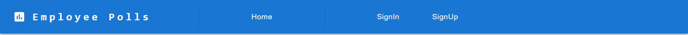

# Employee Polls Project

This is the starter code for the assessment project for Udacity's React & Redux course.

The `_DATA.js` file represents a fake database and methods that let you access the data. The only thing you need to edit in the ` _DATA.js` file is the value of `avatarURL`. Each user should have an avatar, so you’ll need to add the path to each user’s avatar.

You can check content of `_DATA.js` by using this [Link](https://github.com/asharn/Shell-Software-Engineer-Train-to-Hire-Scholarship-Program/blob/main/employee-polls-web-app/src/utils/_DATA.js).

The details about the table and api functions is shown in [README.md](https://github.com/asharn/Shell-Software-Engineer-Train-to-Hire-Scholarship-Program/blob/main/employee-polls-web-app/src/utils/README.md).

You can view live application on Netlify by using this [**Netlify Live Employee Polls Web App**](https://62e0db3bb9a96c492acdc528--splendid-sunshine-05d96a.netlify.app/).

## Content 

- [Getting Started with Employee Polls Project](#getting-started-with-employee-polls-project)
- [SignIn credentials for testing application](#signin-credentials-for-testing-application)
- [Available Scripts](#available-scripts)
    - [Runs the app](#npm-start)
    - [Launches the test runner](#npm-test)
    - [Builds the app for production](#npm-run-build)
    - [Runs the app](#npm-start)
    - [Launches the test runner](#npm-test)
    - [Runs the app with passing all phases](#npm-run-start-all)
- [Hosted on Netlify](#hosted-on-netlify)
- [Hosted on Heroku](#hosted-on-heroku)
- [View components and respective screenshots](#available-components-details-with-screenshots)
    - [Home Component before sign-in](#home-component-before-user-sign-in-is-the-public-page-even-autherized-and-unathorized-users-can-visit)
    - [Home Component after sign-in
](#home-component-after-user-sign-in-will-show-the-changes-in-navbar-component)
    - [SignIn Component](#signin-component-will-help-to-log-in-with-in-the-application-as-autherized-user)
    - [SignUp Component](#signup-component-will-help-to-register-user)
    - [ForgotPassword Component](#forgotpassword-component-will-help-to-reset-password)
    - [Dashboard Component](#dashboard-component-will-show-all-the-new-question-and-all-the-answered-question)
    - [Leaderboard Component](#leaderboard-component-will-show-table-of-usename-answered-and-created-question)
    - [New Poll Component](#newpoll-component-to-create-new-poll)
    - [Question Page Component](#questionpage-component-to-view-and-poll-question)
    - [Question Page Component with incorrect qid](#questionpage-component-when-question-id-is-not-correct)
    - [NavBar Component before sign-in](#navbar-component-before-user-sign-in)
    - [NavBar Component after sign-in](#navbar-component-after-user-sign-in)
    - [PageNotFound Component](#pagenotfound-component-is-used-when-user-trying-to-access-page-that-doesnt-exist)
    - [NotAuthorized Component](#notauthorized-component-is-used-when-user-trying-to-access-page-that-is-not-authorized-for-them)
    - [Copyright Component](#copyright-component-is-used-to-show-copyrigh-section-within-the-footor)

## Getting Started with Employee Polls Project

This project was bootstrapped with [Create React App](https://github.com/facebook/create-react-app).

## SignIn credentials for testing application
These are some pre mapped sign in credential of user which can be used while entering to the applicaiton. Below are the four credential for testing app.

|   S.N0    |   Username        |   Password    |
|-----------|-------------------|---------------|
|   1.      |   sarahedo        |   password123 |
|   2.      |   tylermcginnis   |   abc321      |
|   3.      |   mtsamis         |   xyz123      |
|   4.      |   zoshikanlu      |   pass246     | 

## Available Scripts

In the project directory, you can run:

### `npm start`

Runs the app in the development mode.\
Open [http://localhost:3000](http://localhost:3000) to view it in your browser.

The page will reload when you make changes.\
You may also see any lint errors in the console.

### `npm test`

Launches the test runner in the interactive watch mode.\
See the section about [running tests](https://facebook.github.io/create-react-app/docs/running-tests) for more information.

For code coverage report you can run with --coverage
`npm test -- --coverage --watchAll=false`
`npm test -- --coverage --watchAll=false | grep Statements | awk '{print $3}'`

**ScreenShot of executed test cases is:**

### `npm run build`

Builds the app for production to the `build` folder.\
It correctly bundles React in production mode and optimizes the build for the best performance.

The build is minified and the filenames include the hashes.\
Your app is ready to be deployed!

See the section about [deployment](https://facebook.github.io/create-react-app/docs/deployment) for more information.

### `npm run start-all`

`"start-all": "npm run build && npm test -- --coverage --watchAll=false && npm run start"
`
This script will start build, then run test with showing and creating code coverage report after that server will be up for the application. 

## Hosted on Netlify
This app is deployed on Netlify, so if any one want to check the functionality live then click [**Netlify Live Employee Polls Web App**](https://62e0db3bb9a96c492acdc528--splendid-sunshine-05d96a.netlify.app/). 
I have done some testing on this site. So, go check soon. And if you find any issue please raise concern as issue in git repo, pointing the issue.

## Hosted on Heroku
This app is hoted on heroku, so if any one want to check the functionality and check with this [**Heroku Live Employee Polls Web App**](https://employee-polls-web-app.herokuapp.com/). 

In Heroku hosted, you will see some glitches in style and images which is cause due to Heroku hosting. So, can only verify functionality which will be working correctly.

AWS s3 bucket is not connected, so uploading of images and other files will not work.

## Available Components details with screenshots

#### Home Component before user sign-in is the public page even autherized and unathorized users can visit

#### Home Component after user sign-in will show the changes in NavBar component

#### SignIn Component will help to log in with in the application as autherized user

#### SignUp Component will help to register user

#### ForgotPassword Component will help to reset password

#### Dashboard Component will show all the New Question and all the Answered Question

    
#### Leaderboard Component will show table of usename, answered and created question

    
#### NewPoll Component to create new poll

    
#### QuestionPage Component to view and poll question

#### QuestionPage Component when question id is not correct

#### NavBar Component before user sign-in

#### NavBar Component after user sign-in

#### PageNotFound Component is used when user trying to access page that doesn't exist.

#### NotAuthorized Component is used when user trying to access page that is not authorized for them.

#### Copyright Component is used to show copyrigh section within the footor
