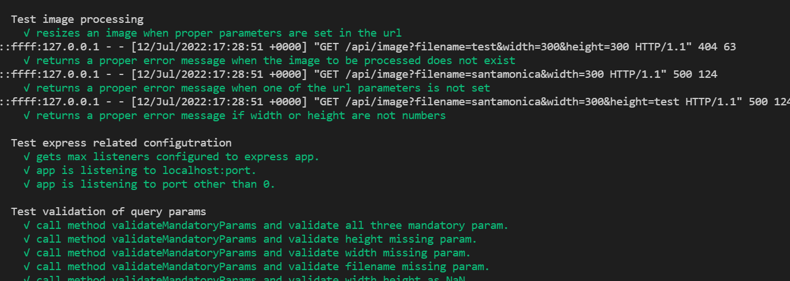
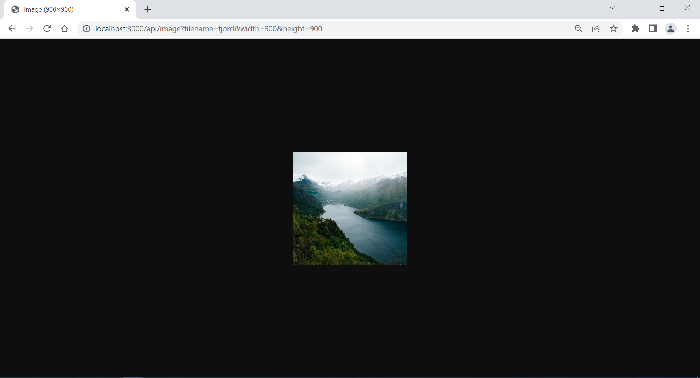

# Image processing API

This project aims to give we a real-world scenario in which we would read and write to our disk via a Node.js express server rather than a database. The project we create serves two purposes: to prepare us for setting up scalable code and architecture for real-world projects and tie together some of the most popular middleware and utilities found in Node.js projects. This project barely touches the surface of what is possible but will prove your ability to use what you’ve learned in real-world scenarios.

- Resize any jpg image by setting its name and the desired width and height as parameters in the URL.
- The image created will have the same name as the original, and the width and height chosen, for easy identification.
- If an image with the width and height chosen has already been created, the server responds with the existing image, instead of processing it again.

## To run on local
- Download or clone the project by ```git clone https://github.com/asharn/Shell-Software-Engineer-Train-to-Hire-Scholarship-Program.git```
- Run ```npm i```

## Testing
- Run ```npm run test``` to run the tests stablished in ```tests``` with names *Spec*.ts.
- Testing is implemented with jasmine
- ScreenShot of executed test cases is: 

## Run developer server
- Run ```npm run start-dev```
- The project includes nodemon so any change made to a file and saved will restart the server


## Build the project
- Run ```npm run build```
- This will compile the code and create js fie to dist


## Run project and Validate image API's
- Start the app with ```npm run start```
- This will run all the script created to run app.
- This execute script at once ```"start": "npm run prettier && npm run lint && npm run test && npm run start-dev"```
- Set the image you want to resize under ```assets/images/input-files``` (The file must be a .jpg)
- Use the URL ```http://localhost:3000/api/image``` and set the name of the image (filename) and the desired width and height as parameters, for example: ```http://localhost:3000/api/image?filename=fjord&width=900&height=900```
- You'll get the resized image in the browser, and you can see it as well under ```assets/images/output-files```

